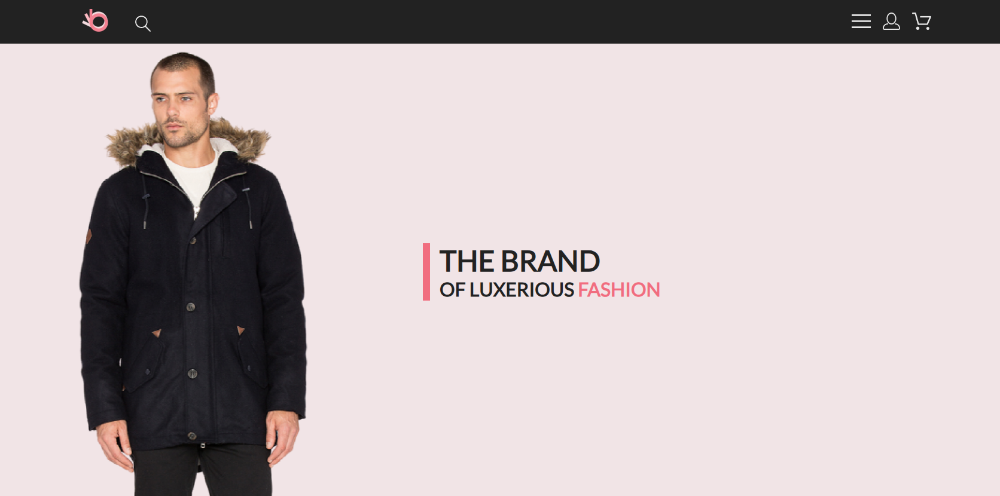
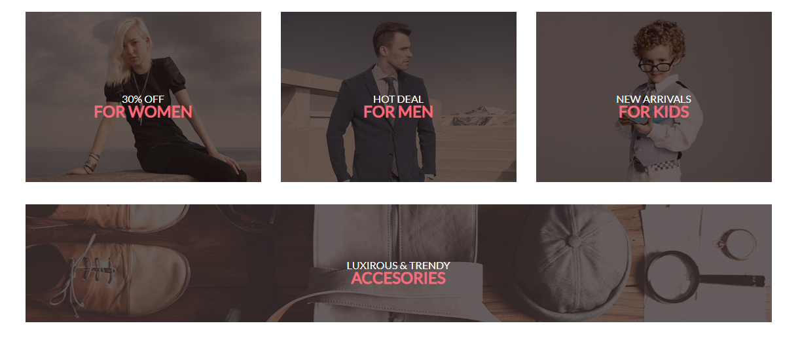
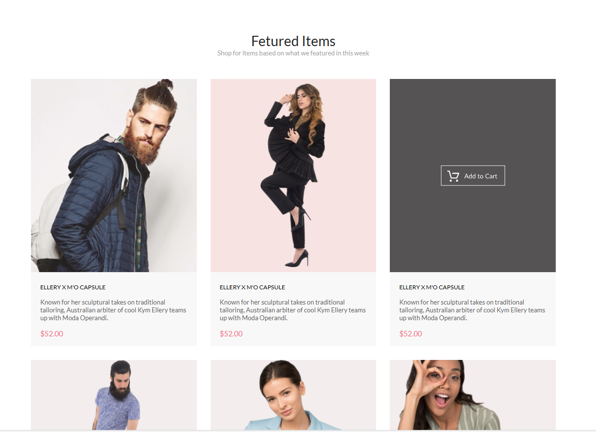
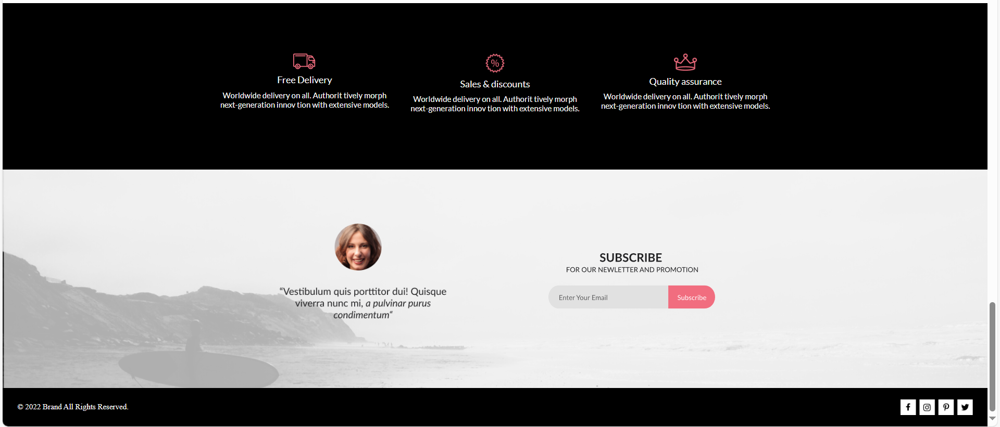

# BRAND 

Интернет-магазин одежды и аксессуаров  / Online clothing and accessories store

## Краткое описание проекта / Brief description of the project

BRAND - это интернет-магазин одежды и аксессуаров для взрослых и детей! В данном проекте я продемонстрировала свои навыки в верстке, используя редактор Figma, а также HTML и CSS. Кроме того, я разработала адаптивную верстку для планшетных и мобильных устройств, а также реализовала выпадающее меню для удобства навигации.

BRAND is an online clothing and accessories store for adults and children! This project demonstrates my layout skills using HTML, CSS and JavaScript. I aimed to create an attractive and functional interface that provides convenience for users.

## Технологии / Technologies

* Верстка страницы сайта выполнена на основе макета, созданного в Figma.
* HTML: Структура страницы и разметка контента.  
* CSS: Стилизация элементов

